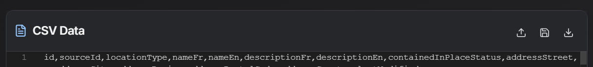
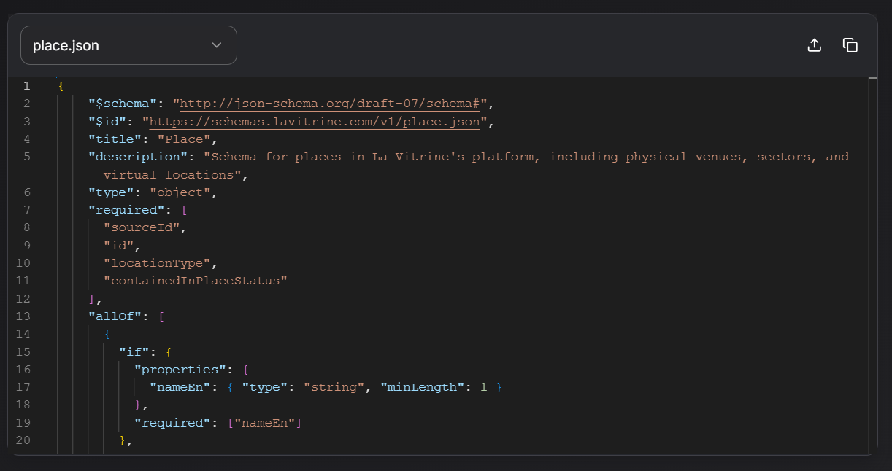
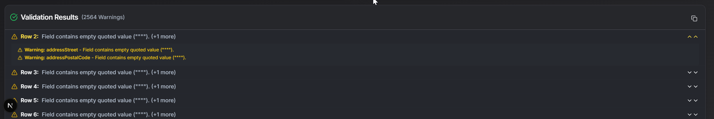
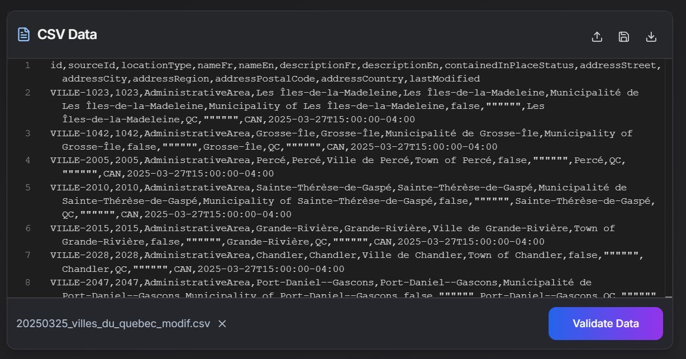

# CSV Data Validator 📊✅

[](https://nextjs.org/)
[](https://www.typescriptlang.org/)
[](https://ajv.js.org/)
[](https://ui.shadcn.com/)

A web-based tool to validate CSV data against JSON schemas directly in your browser. Edit your data on the fly and ensure compliance with predefined or custom structures.

---

## ✨ Features

*   **CSV Upload:** Easily upload your CSV files via drag-and-drop or file selection.
*   **Schema Selection:** Choose from a list of predefined JSON schemas tailored for specific data types.
*   **Custom Schema Upload:** Validate against your own JSON schema by uploading it.
*   **In-Browser Validation:** Performs validation locally using Web Workers for a smooth UI experience.
*   **Detailed Results:** View a clear list of validation errors and warnings, sorted with errors first.
    *   **Specific Value Highlighting:** Error messages pinpoint the exact value that caused the issue.
*   **Live CSV Editing:** Modify your CSV data directly within the application using a code editor interface.
*   **Save Modified CSV:** Download the edited CSV data back to your local machine.
*   **Auto Re-validation:** Automatically re-validates the CSV data after saving changes.

---

## 🚀 Getting Started

### Prerequisites

*   Node.js (v18 or later recommended)
*   pnpm (or npm/yarn)

### Installation & Running Locally

1.  **Clone the repository:**
    ```bash
    git clone https://github.com/FabienDostieIT/CSV_Data_Validator.git
    cd CSV_Data_Validator
    ```

2.  **Install dependencies:**
    ```bash
    pnpm install
    # or npm install / yarn install
    ```

3.  **Run the development server:**
    ```bash
    pnpm dev
    # or npm run dev / yarn dev
    ```

4.  Open [http://localhost:3000](http://localhost:3000) in your browser.

---

## 🛠️ How to Use

### 1. Upload CSV File

*   Drag and drop your CSV file onto the designated area.
*   Alternatively, click the upload area to open a file selection dialog.
*   The raw CSV content will be displayed in the editor pane.

    

### 2. Select or Upload Schema

*   **Predefined Schema:** Choose a schema from the dropdown list (e.g., `productSchema`, `userSchema`). The validation will use this structure.
*   **Custom Schema:**
    *   Click the "Upload Custom Schema" button.
    *   Select your JSON schema file (`.json`).
    *   The application will use your uploaded schema for validation.

     

### 3. Validate Data

*   Click the "Validate CSV" button.
*   The validation process runs in the background.
*   A loading indicator will show while processing.

### 4. Review Results

*   Once validation is complete, the "Validation Results" section will appear below the editor.
*   Results are categorized into **Errors** and **Warnings**.
*   Errors are listed first, followed by warnings.
*   Each result shows:
    *   Row Number (in the original CSV)
    *   Error/Warning Message (including the specific problematic value)
    *   Schema Path (`instancePath`) indicating the location of the issue within the data structure.
*   Counts for total errors and warnings are displayed.

    

### 5. Edit CSV Data

*   You can directly edit the text in the CSV editor pane on the left.
*   Make corrections based on the validation results or perform other modifications.

     

### 6. Save Modified CSV

*   Click the "Save CSV" button.
*   This will trigger a download of the currently displayed CSV content as a `.csv` file.

### 7. Automatic Re-validation After Save

*   After saving the CSV, the application automatically re-parses the data from the editor and runs the validation again with the selected schema.
*   The results panel will update to reflect the validity of the *saved* data.

---

## 💻 Tech Stack

*   **Frontend:** Next.js (React Framework), TypeScript
*   **UI Components:** Shadcn/ui, Radix UI, Tailwind CSS
*   **CSV Parsing:** PapaParse
*   **Schema Validation:** Ajv (Another JSON Schema Validator)
*   **Code Editor:** CodeMirror
*   **State Management:** React Hooks (useState, useCallback, useRef)
*   **Asynchronous Operations:** Web Workers


---

<div align="center">
  ✔️ Made with ❤️ by the fine people @ [F]it 👌
</div>

---

## 🤝 Contributing

Contributions are welcome! If you find a bug or have a feature request, please open an issue on GitHub.

If you'd like to contribute code:

1.  Fork the repository.
2.  Create a new branch for your feature or bug fix (`git checkout -b feature/your-feature` or `git checkout -b fix/your-bug`).
3.  Make your changes and commit them with clear messages.
4.  Push your branch to your fork (`git push origin feature/your-feature`).
5.  Open a Pull Request back to the main repository's `develop` branch.

Please ensure your code adheres to the existing style and that any relevant tests pass (if applicable).

---

## 📄 License

This project is licensed under the MIT License.

**MIT License**

Copyright (c) 2025 Fabien Dostie, [F]it

Permission is hereby granted, free of charge, to any person obtaining a copy
of this software and associated documentation files (the "Software"), to deal
in the Software without restriction, including without limitation the rights
to use, copy, modify, merge, publish, distribute, sublicense, and/or sell
copies of the Software, and to permit persons to whom the Software is
furnished to do so, subject to the following conditions:

The above copyright notice and this permission notice shall be included in all
copies or substantial portions of the Software.

THE SOFTWARE IS PROVIDED "AS IS", WITHOUT WARRANTY OF ANY KIND, EXPRESS OR
IMPLIED, INCLUDING BUT NOT LIMITED TO THE WARRANTIES OF MERCHANTABILITY,
FITNESS FOR A PARTICULAR PURPOSE AND NONINFRINGEMENT. IN NO EVENT SHALL THE
AUTHORS OR COPYRIGHT HOLDERS BE LIABLE FOR ANY CLAIM, DAMAGES OR OTHER
LIABILITY, WHETHER IN AN ACTION OF CONTRACT, TORT OR OTHERWISE, ARISING FROM,
OUT OF OR IN CONNECTION WITH THE SOFTWARE OR THE USE OR OTHER DEALINGS IN THE
SOFTWARE. 